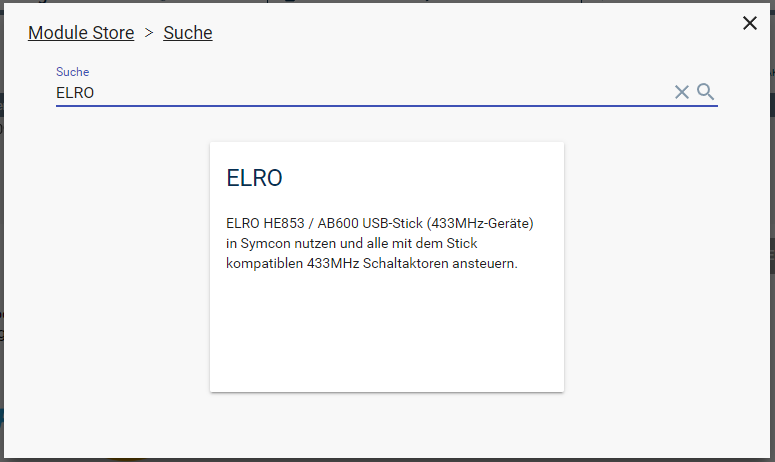

[](https://www.symcon.de/service/dokumentation/entwicklerbereich/sdk-tools/sdk-php/)
[]()
[](https://www.symcon.de/de/service/dokumentation/installation/migrationen/v80-v81-q3-2025/)  
[](https://creativecommons.org/licenses/by-nc-sa/4.0/)
[](https://github.com/Nall-chan/Elro/actions) [](https://github.com/Nall-chan/Elro/actions)  
[](#7-spenden)
[](#7-spenden)  


# Elro <!-- omit in toc -->  
IPS-Modul für den ELRO HE853 / AB600 USB-Stick (433MHz-Geräte)  

## Inhaltsverzeichnis <!-- omit in toc -->   

- [1. Funktionsumfang](#1-funktionsumfang)
- [2. Voraussetzungen](#2-voraussetzungen)
- [3. Software-Installation](#3-software-installation)
- [4. Einrichten der Instanzen in IPS](#4-einrichten-der-instanzen-in-ips)
- [5. PHP-Befehlsreferenz](#5-php-befehlsreferenz)
- [6. Parameter / Modul-Infos](#6-parameter--modul-infos)
- [7. Spenden](#7-spenden)
- [8. Changelog](#8-changelog)
- [9. Lizenz](#9-lizenz)

## 1. Funktionsumfang

   Direkte Unterstützung des ELRO HE853 / AB600 USB-Stick um Aktoren auf Basis von 433Mhz zu steuern.  
   Es werden aktuell folgende Schaltaktoren unterstützt:  
    - ELRO (und baugleiche) mit DIP-Schaltern  
    - Intertechno  
    - REV und FLS 100 mit Dreh-Schaltern (RS => Rotary Switch)  
    - Selbstlernende Geräte div. Hersteller/Marken  
    - Sowie alle Geräte wo der 'Code' bekannt ist über die Generic Instanz.  

   Achtung diese Systeme bieten KEIN Rückmeldung der Aktoren.  
   Aktuell werden nur Schaltaktoren unterstützt.  

## 2. Voraussetzungen

   * IP-Symcon 8.1 oder neuer  
   * Der USB-Stick HE853 bzw. AB600 von Elro  
   * Ein nicht belegter USB-Anschluss an dem System, wo IPS betrieben wird  

## 3. Software-Installation

  Über den 'Module-Store' in IPS das Modul 'ONVIF' hinzufügen.  
   **Bei kommerzieller Nutzung (z.B. als Errichter oder Integrator) wenden Sie sich bitte an den Autor.**  
    


## 4. Einrichten der Instanzen in IPS

   **Einrichtung USB-Stick:**  
    - Stick anschließen.  
    - Im Objektbaum über Objekt hinzufügen -> Instanz hinzufügen wählen.  
    - Den Haken 'Alle Module zeigen' setzten.  
    - Unter System '(I/O)' auswählen und ein 'HID' hinzufügen.  
    - Im sich öffnenden Konfigurationsdialog zuerst 'HID Gerät öffnen' wählen und als Gerät den USB-Stick (ABLOCK: CK?RFController[....]) auswählen.  
    - Übernehmen und Reiter schließen.  

   **Einrichtung Funksteckdose in IPS:**  
    - Im Objektbaum über Objekt hinzufügen -> Instanz hinzufügen wählen.  
    - Unter System 'ELRO' auswählen und das passende Gerät hinzufügen.  
    - Im sich öffnenden Konfigurationsdialog zuerst unten die korrekte Übergeordnete Instanz (Die HID-Instanz mit dem USB-Stick) auswählen.  
    - Anschließend noch die Einstellungen entsprechen dem des Empfängers einstellen und speichern. ('Self-Learning' Geräte siehe weiter unten.).  
    - Das mit allen Geräten wiederholen, Geräte welche immer zusammen geschaltet werden, können die gleichen DIP/RS-Einstellungen verwenden!  

   Die StatusVariable 'STATE' ist dem Standardprofil ~Switch zugeteilt, und über die eingebaute Standardaktion auch sofort vom WebFront aus schaltbar.

   **'Self-Learning'-Geräte:**  
    - Erst in IPS die Instanz anlegen und mit eine ausgedachten DIP/RS Adresse einrichten.  
    - Anschließend Gerät in den Anlernmodus versetzen.  
    - Jetzt z.B. im WebFront das entsprechende Gerät einmal EIN- und AUS-Schalten.  
    - Das Gerät sollte den Anlernmodus automatisch verlassen haben, und sich jetzt steuern lassen.  
    - Wenn es nicht funktioniert hat, einfach mit einem anderen Typ von Instanz wiederholen.  

   **Intertechno Generic:**  
    - Der Code ist immer 10stellig bestehend aus 0 1 oder F einzutragen.  
    - Für ON und OFF immer zweistellig.  
    - Codes:[Intertechno Code Berechnung](https://wiki.fhem.de/wiki/Intertechno_Code_Berechnung)  

## 5. PHP-Befehlsreferenz

```php
    boolean ELRO_SendSwitch(integer $InstanceID, boolean $State);
```
   **Beispiele:**  

```php
    // Einschalten.. nur so (E_Warning bei Fehler @ verwenden!)
    @ELRO_SendSwitch(54727 /*[Hardware\ELRO DIP]*/ ,true);

    // Ausschalten mit Abfrage ob Befehl erfolgreich abgesetzt werden konnte
    if (!@ELRO_SendSwitch(54727 /*[Hardware\ELRO DIP]*/ ,false)) die ("Konnte nicht einschalten.");
```


## 6. Parameter / Modul-Infos

**GUID:**  
GUID der Instanzen (z.B. wenn Instanz per PHP angelegt werden soll):  

|               Device               |                  GUID                  |
| :--------------------------------: | :------------------------------------: |
|        ELRO  Schalter (DIP)        | {49575274-BD5B-4FE1-AF7B-D98F2566BFE0} |
| AB600 / Intertechno  Schalter (RS) | {4334935A-A711-45F8-AE9D-FED61A118ABF} |
|       FLS 100 Schalter (RS)        | {006FF555-940D-40DE-B9B5-CDBE22C0828D} |
|         REV Schalter (RS)          | {7AC6EBE8-8AC9-43F8-930F-0813D10F52C2} |
|        Intertechno Generic         | {C336B7C1-0F32-4601-B5ED-376546FC1779} |

**Eigenschaften von ELRO  Schalter (DIP) :**  

| Eigenschaft |   Typ   | Standardwert |                 Funktion                 |
| :---------: | :-----: | :----------: | :--------------------------------------: |
|    Bit9     | boolean |    false     |              Dip-Schalter 1              |
|    Bit8     | boolean |    false     |              Dip-Schalter 2              |
|    Bit7     | boolean |    false     |              Dip-Schalter 3              |
|    Bit6     | boolean |    false     |              Dip-Schalter 4              |
|    Bit5     | boolean |    false     |              Dip-Schalter 5              |
|    Bit4     | boolean |    false     |              Dip-Schalter A              |
|    Bit3     | boolean |    false     |              Dip-Schalter B              |
|    Bit2     | boolean |    false     |              Dip-Schalter C              |
|    Bit1     | boolean |    false     |              Dip-Schalter D              |
|    Bit0     | boolean |    false     |              Dip-Schalter E              |
|   Repeat    | integer |      2       | Anzahl wie häufig der Code gesendet wird |

**Eigenschaften von AB600 / Intertechno  Schalter (RS) :**  

| Eigenschaft |   Typ   | Standardwert |                 Funktion                 |
| :---------: | :-----: | :----------: | :--------------------------------------: |
|   CharAdr   | string  |      00      |         Rotary-Switch Buchstabe          |
|   ByteAdr   | string  |      00      |            Rotary-Switch Zahl            |
|   Repeat    | integer |      2       | Anzahl wie häufig der Code gesendet wird |

**Eigenschaften von FLS 100 Schalter (RS) :**  

| Eigenschaft |   Typ   | Standardwert |                 Funktion                 |
| :---------: | :-----: | :----------: | :--------------------------------------: |
|   CharAdr   | string  |      15      |      Rotary-Switch Römische Ziffer       |
|   ByteAdr   | string  |      15      |            Rotary-Switch Zahl            |
|   Repeat    | integer |      2       | Anzahl wie häufig der Code gesendet wird |

**Eigenschaften von REV Schalter (RS) :**  

| Eigenschaft |   Typ   | Standardwert |                 Funktion                 |
| :---------: | :-----: | :----------: | :--------------------------------------: |
|   CharAdr   | string  |      D5      |         Rotary-Switch Buchstabe          |
|   ByteAdr   | string  |      D4      |            Rotary-Switch Zahl            |
|   Repeat    | integer |      2       | Anzahl wie häufig der Code gesendet wird |

**Eigenschaften von Intertechno Generic :**  

| Eigenschaft |   Typ   | Standardwert |                 Funktion                 |
| :---------: | :-----: | :----------: | :--------------------------------------: |
|    Code     | string  |              |     Adresse bestehend aus 0, 1 und F     |
|   CodeOn    | string  |              |    An-Befehl bestehend aus 0, 1 und F    |
|   CodeOff   | string  |              |   Aus-Befehl bestehend aus 0, 1 und F    |
|   Repeat    | integer |      2       | Anzahl wie häufig der Code gesendet wird |

## 7. Spenden
  
  Die Library ist für die nicht kommerzielle Nutzung kostenlos, Schenkungen als Unterstützung für den Autor werden hier akzeptiert:  

  PayPal:  
[](https://paypal.me/Nall4chan)  

  Wunschliste:  
[](https://www.amazon.de/hz/wishlist/ls/YU4AI9AQT9F?ref_=wl_share)  

## 8. Changelog

**5.21:**  
Neu: Release für IPS 8.1  

**5.2:**  
Neu: Release für IPS 5.1 und den Module-Store  

**5.00:**  
Neu: Modul intern umgebaut  
Fix: Konfigurationsformulare nutzen durchgängig caption als Ersatz für label.  

**2.04:**  
Fixes für IPS 5.0  

**2.03:**  
Neu: Übersetzungen für IPS 4.3

**2.02:**  
Neu: Intertechno Generic Gerät  
Fix: DIP Schalter wurden falsch ausgewertet.  
Fix: RS2 Instanz (REV Schalter) wurde Nummer 3 falsch ausgewertet. 

**2.01:**  
Fix: Workaround für IPS 4  

**2.00:**  
Neu: Umsetzung für IPS 4  

## 9. Lizenz

  [CC BY-NC-SA 4.0](https://creativecommons.org/licenses/by-nc-sa/4.0/)  
